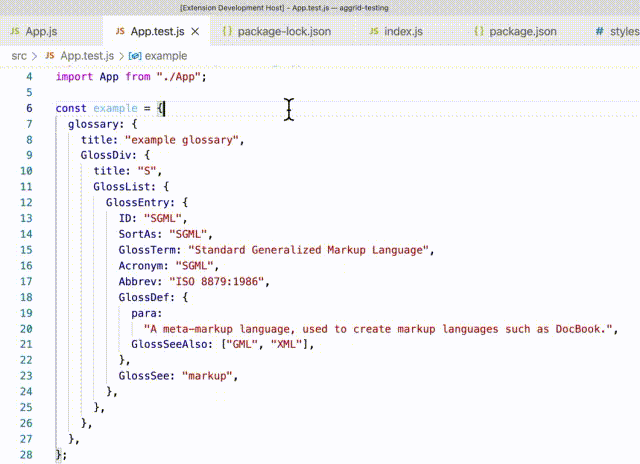

# JASPER

This extension shows the path to the JSON attribute you are hovering over.

## Features

Displays hover text path for JSON at the root level in modules (javascript) or in JSON files.

---

## Extension Settings

This extension contributes the following settings:

- `jasper.start`: enable this extension

## Known Issues

Calling out known issues can help limit users opening duplicate issues against your extension.

## Release Notes

### 1.0.0

Initial release of Jasper for processing simple JSON and Javascript files

---

## Attributions

Icons made by <a href="https://www.freepik.com" title="Freepik">Freepik</a> from <a href="https://www.flaticon.com/" title="Flaticon">www.flaticon.com</a>

